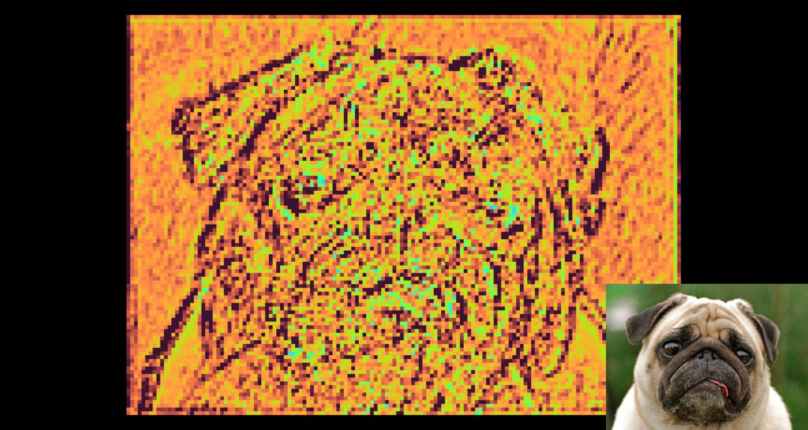

# MapExtrakt

> Convolutional Nerual Networks Are Beautiful

We all take our eyes for granted, we glance at an object for an instant and  our brains identify objects with ease.
However distorted this information may be, we do a pretty good job at it.

Low light, obscured vision, there are a myriad of situations where conditions are poor but still we manage to understand what an object it.
Context helps, but we were created with sight in mind.

Computers have a harder time, but modern advances with Convolutional Neural Networks are making this task a reality and have now surpassed human level accuracy.

Computers are beautifull, Convolutional Neural Networks are beautifull. And the maps they create to determine what makes a cat a cat are beautiful.

### MapExtrakt makes viewing feature maps a breeze.

```python

# load a model 
import torchvision
model = torchvision.models.vgg16(pretrained=True)

#import FeatureExtractor
from MapExtrakt import FeatureExtractor

#load the model and image
fe = FeatureExtractor(model)
fe.set_image("cat.jpg")

#gather maps
img = fe.display_from_map(layer_no=2, out_type="pil", colourize=20, outsize=(1000,500), border=0.03, picture_in_picture=True)
img.save("example_output.jpg")
img

```

